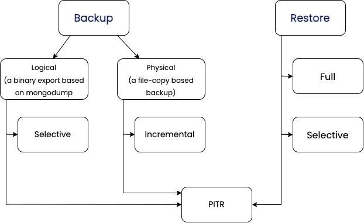

# Percona Backup for MongoDB Documentation

Percona Backup for MongoDB is an open-source, distributed and low-impact solution for consistent backups of [MongoDB sharded clusters and replica sets](deployments.md). 

It enables you to make logical, physical, incremental and selective backups and restores. [Point-in-Time recovery](usage/point-in-time-recovery.md) functionality allows you to recover your database to a specific timestamp. 

With Percona Backup for MongoDB you can design and implement the effective backup strategy that considers the size and usage patterns of your database, the resources it utilizes and the goals of your organization. 

!!! note ""

    This is the documentation for the latest release, **PBM {{release}}** ([Release Notes](release-notes/{{release}}.md)).

## What you can do with Percona Backup for MongoDB

* Logical backups to back up and / or migrate data to different platforms and database versions
* Physical backups to speed up performance for large (multi-terabyte) data sets
* Selective backups to work with the desired data set
* Incremental physical backups to ensure regular backups of critical data and to save on costs for storage and transfer
* Restore the database to a desired time
* Restore specific databases / collections from a full backup
* Replay oplog on top of EBS-snapshots

Learn more about [PBM features](backup-types.md)

## What’s in it for you?

* Data consistency across sharded clusters and replica sets, including distributed transaction consistency with MongoDB 4.2+
* Simple, [integrated-with-MongoDB authentication](initial-setup.md#external -authentication-support-in-percona-backup-for-mongodb)
* No vendor lock-in due to a variety of [supported storage types](storage-confoguration.md)
* Open-source solution with [enterprise-grade features](comparison.md)

[Install and get started](installation.md)

## Go further with Percona Backup for MongoDB

* Learn [how Percona Backup for MongoDB works](intro.md)
* Manage PBM
* Contribute to PBM

